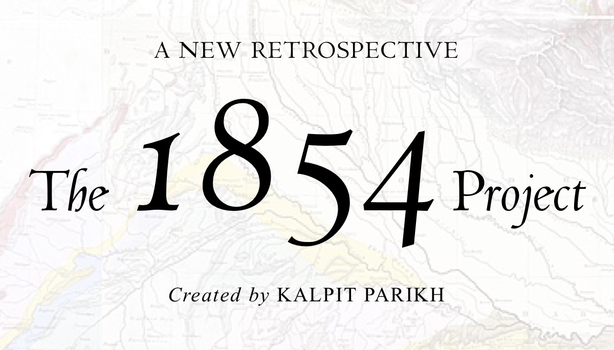

## Hi there 👋

 

The 1854 Project is a historical work in the vein of the 1619 Project—a ground-breaking reframing of India's history that placed consequences of colonialism and the contributions of Indians at the very center of India's many narratives.[^1] The project, which was initially launched in April of 2023, offered a revealing new origin story for Indology, one that helped explain not only the persistence of colonial frameworks in India's historiography today, but also the roots of so much of what makes India unique.

[^1]: [_Maya_] is most strange. Her nature is inexplicable (<a href="https://archive.org/details/shankarascrestje0000sank/page/48/mode/2up">_vivekacūḍāmaṇi_ 109</a>).
